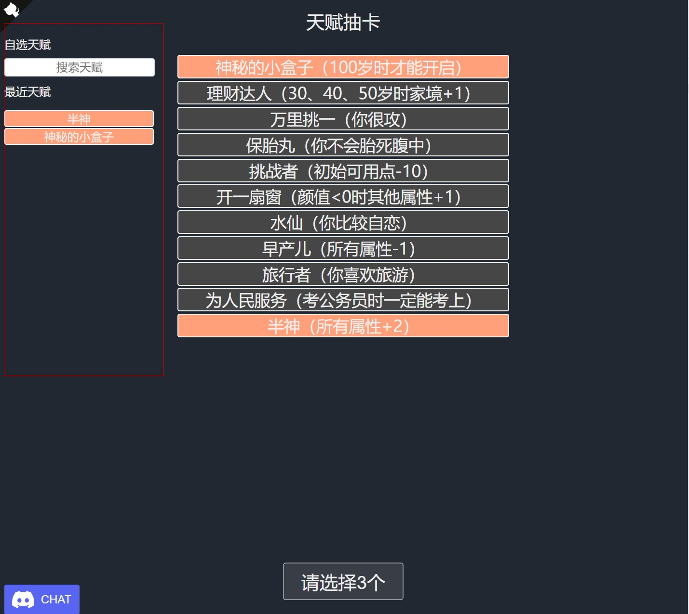

\- 人生不尽意，重开不迷路 \-

---

这是一个针对 [人生重开模拟器](http://liferestart.syaro.io/view/index.html) 的油猴脚本
若没有安装油猴插件，需要先自行去安装 chrome 插件：https://www.tampermonkey.net  
然后 [点击安装脚本](https://github.com/D780/liferestart.user.js/raw/master/main.user.js)

---

### 脚本功能

脚本会在游戏的天赋选择页面的左侧空白处，添加一个可以自选天赋的控件

从自选天赋中添加到天赋抽卡列表中的天赋会在下一次进入的时候加入到最近天赋列表中，方便后续使用（最多保存10个）

不多说，如下图所示

